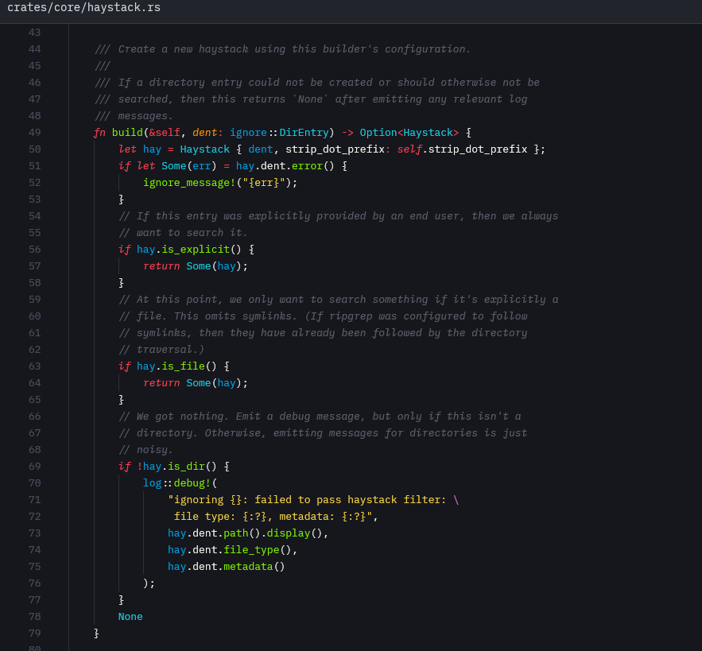
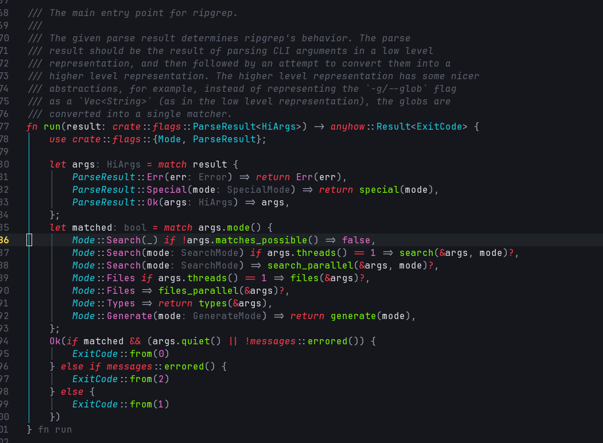

<p align="center">
    
    <h2 align="center" style="letter-spacing:2px;font-weight:700">MONOKAI VIBRANT (Rust)</h2>
</p>

<p align="center">A very dark and vibrant Monokai based theme - forked and modified for Rust and Dioxus</p>

> This is a fork of [s3gf4ult/monokai-vibrant](https://github.com/s3gf4ult/monokai-vibrant) with some modifications to make it work with Dioxus and Rust. We modified some colors to be better for Rust code and added support for modern language features.

**THIS IS A FORK OF A FORK TO MAKE IT WORK IN ZED/NEOVIM**

Contains 2024 keywords and newer C++ keywords (check changelog)

**I MAY MAKE THIS UPSTREAM, NOT SURE, NOT TESTED IT MUCH YET**
VsCode 


Zed



Neovim 




## Install

1. Open the **Extensions** sidebar in VS Code.
2. Search for `Monokai Vibrant`. Choose the one by ~~**s3gf4ult**~~ **DioxusLabs**
3. Click the **Install** button
4. Go to Preferences ‣ Color Theme ‣ **Monokai Vibrant (Rust)**

## Disable Italics

If you are not using a font that does not support italics, you can add this to your `settings.json` to disable them.

```json
"editor.tokenColorCustomizations": {
  "textMateRules": [
    {
      "name": "Monokai Vibrant - No Italics",
      "scope": [
        "comment",
        "string.comment",
        "variable.language",
        "keyword",
        "storage",
        "variable.parameter"
      ],
      "settings": {
        "fontStyle": ""
      }
    }
  ]
}
```

## Extras

Color schemes for other popular applications are available in the `/extras` folder:

- **Neovim/Vim**: Full colorscheme support with Treesitter, LSP, and plugin integration
  - See [`/extras/README-neovim.md`](extras/README-neovim.md) for installation instructions
  - Vim script version: `extras/monokai-vibrant-rust.vim`
  - Lua version: `extras/nvim/colors/monokai-vibrant-rust.lua`
- **iTerm2**: Terminal color scheme (`extras/Monokai-Vibrant-iTerm2.itermcolors`)

Additional editor support contributions are welcome!

---

Don't forget to leave a review on the marketplace! **Enjoy!**
